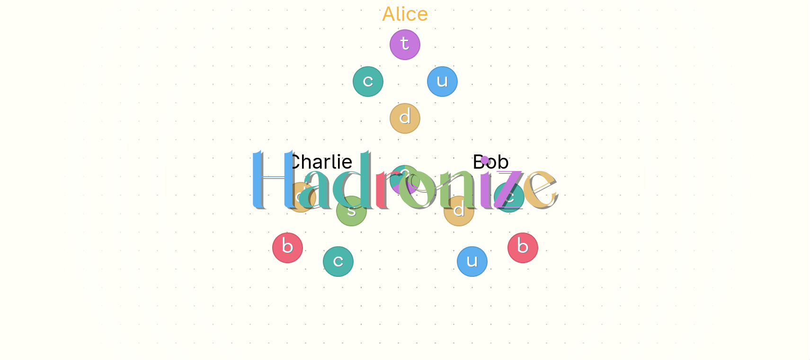

# Hadronize

[](https://ethmarks.github.io/hadronize/)
[](https://github.com/ethmarks/hadronize)

Quark-themed set collection game you can play in your browser.



## Quickstart

> **The recommended starting point is <https://ethmarks.github.io/hadronize/how>.**

If you'd like to jump right in without reading the rules or instructions, you can either visit <https://ethmarks.github.io/hadronize/play> to play in your browser, or you can run the following command to play in your terminal:

```sh
npx deno run -A http://ethmarks.github.io/hadronize/cli.ts
```

## Features

- **Layout optimization engine**: The [Hadronize web UI](https://ethmarks.github.io/hadronize/play) uses a custom layout algorithm to ensure that all elements remain visible and readable on *all* screen sizes, using a virtual layout plan and an escalating series of compromises for small screens and high element counts. This lets the web UI work seamlessly on desktop, mobile, and *any* browser environment without using hardcoded breakpoints.
- **User-created bots**: Players can be controlled by bots whose source code can be altered on-the-fly at runtime in the [bot editor](https://ethmarks.github.io/hadronize/bots).
- **CLI that also works in the browser console**: The [Hadronize CLI](https://ethmarks.github.io/hadronize/cli) can run in Node, Deno, Bun, and the browser console. The first three required making the entire codebase a polyglot that only uses the subset of TypeScript that both Node and Deno support without a compatibility layer. To make the browser console accept user input, I used a trick involving dynamically created named window properties.
- **Comprehensive test suite**: 120 total unit tests that verify that the game logic is implemented correctly and detect regressions.
- **Easy onboarding**: [How to play page](https://ethmarks.github.io/hadronize/how) that explains how the rules and how to use the UI in 3-4 minutes assuming zero knowledge.

## Rules

- 2-6 players
- ~10 minutes per game

### Goal

Be the first player to hadronize 10 or more quarks.

### Quarks

**Quarks** are the fundamental game mechanic in Hadronize. There are
[6 different flavors](https://en.wikipedia.org/wiki/Quark#Classification) of
quark: up, down, strange, charm, bottom, and top.

**Superposed Quarks** are quarks in a state of superposition between three
different flavors. The flavors of the superposition are public information and
can be seen by all players. Upon being observed, the superposition collapses
into one of the flavors, and the superposed quark becomes a normal quark. It is
impossible to tell which flavor the quark will ahead into ahead of time.

### Setup

At the start of the game, each player starts with 4 collapsed quarks with
randomly-chosen flavors. Each player's collection of quarks is called a
[**Cloud Chamber**](https://en.wikipedia.org/wiki/Cloud_chamber). Cloud chambers
can hold an unlimited number of quarks.

### Gameplay

Starting from a randomly-chosen starting player, play proceeds clockwise.

On each turn, a new superposed quark is produced out of vacuum fluctuations. The
active player must select any player (**including themselves**), who will then
observe the new quark. Upon observation, the superposed quark collapses into one
of its three possible flavors and is added to the observing player's cloud
chamber.

If the observing player did _not_ already have any quarks of the same flavor as
the new quark in their cloud chamber, the turn ends and play proceeds to the
next player.

If the observing player already had at least one quark of the same flavor as the
new quark, the new quark reacts with the existing quarks in a way that depends
on which player observed the quark.

**If the observing player is the same as the active player**: the new quark
reacts with all existing quarks of the same flavor, and they all **hadronize**
together. Hadronized quarks can _NOT_ react with new quarks, but they count
towards the active player's score.

**If the observing player is different from the active player**: the new quark
reacts with all existing quarks of the same flavor, and they all **quantum
tunnel** from the observing player's chamber into the active player's cloud
chamber. Quarks can _NOT_ hadronize immediately after quantum tunneling, but on
all subsequent turns they can react, hadronize, and quantum tunnel just like
normal.

Once the new quark is added and the reaction completes, the turn ends and play
proceeds to the next player.

### Examples

Alice has three charm quarks but zero strange quarks in her cloud chamber, and
Bob has three strange quarks but zero charm quarks in his cloud chamber. It is
Alice's turn. A new superposed quark appears, and Alice sees that its
superposition is between charm, strange, and up. Alice...

- ...makes herself observe the new quark. It collapses in her cloud chamber,
  into a...
  - ...charm quark. It reacts with Alice's existing charm quarks, and the four
    (3 existing + 1 new) quarks hadronize. Alice is now four hadronized quarks
    closer to winning.
  - ...strange quark. It does nothing because Alice doesn't have any existing
    strange quarks for it to react with. Alice now has a strange quark in her
    cloud chamber.
- ...makes Bob observe the new quark. It collapses in his cloud chamber, into
  a...
  - ...charm quark. It does nothing because Bob doesn't have any charm quarks
    for it to react with. Bob now has a charm quark in his cloud chamber and
    Alice's cloud chamber is unchanged.
  - ...strange quark. It reacts with Bob's existing strange quarks, and the four
    (3 existing + 1 new) quarks quantum tunnel into Alice's cloud chamber. Alice
    now has four strange quarks in her cloud chamber and Bob has zero strange
    quarks in his cloud chamber.

## Acknowledgements

- Thanks to Exploding Kittens for making [Mantis](https://www.explodingkittens.com/products/mantis), which Hadronize is _heavily_ inspired by.
- Thanks to [Evgeny Orekhov](https://github.com/EvgenyOrekhov) for making [holiday.css](https://holidaycss.js.org/), which is used as a base for the website styles (though the actual game UI was made entirely by me).
- Thanks to [Fabrice Bellard](https://github.com/bellard) for making [QuickJS](https://github.com/bellard/quickjs) and to [Jake Teton-Landis](https://github.com/justjake) for [porting it to WASM](https://github.com/justjake/quickjs-emscripten), which is used for running the drivers.
- Thanks to [Jonas Pytte](https://github.com/jonpyt) for making [Prism code editor](https://github.com/jonpyt/prism-code-editor), which is used for the IDE in the bot editor.
- Thanks to [Oleksii](https://github.com/alexeyraspopov) for making [picocolors](https://github.com/alexeyraspopov/picocolors), which is used for the ANSI colors in the CLI.

## License

This project is under an MIT License. See [LICENSE](LICENSE) for more
information.
