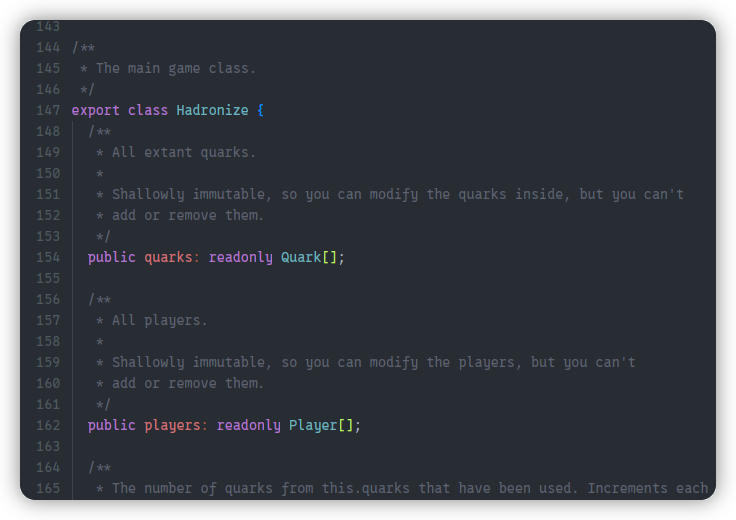
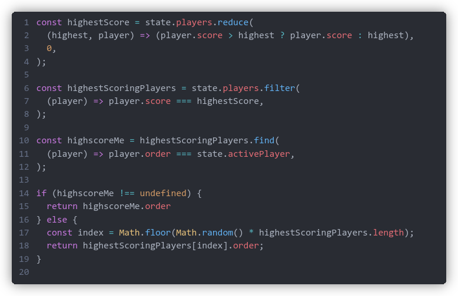
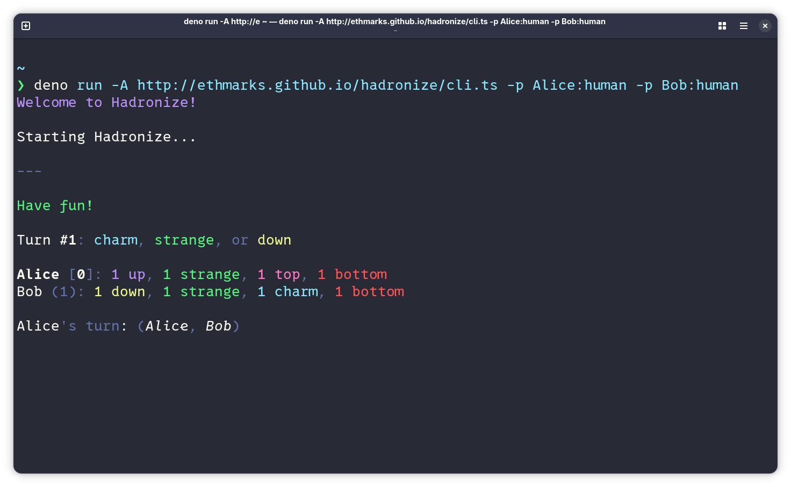
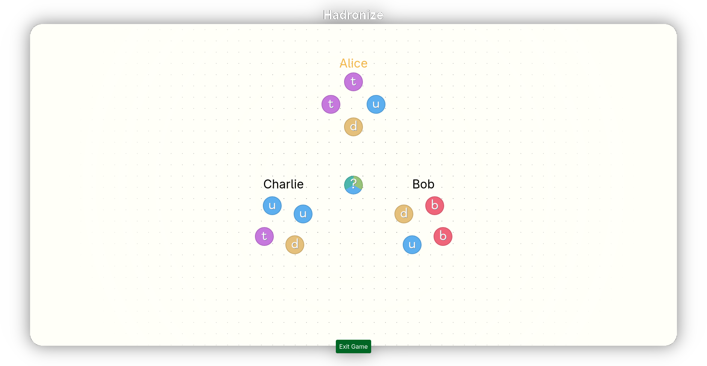

# Hadronize

[](https://ethmarks.github.io/hadronize/)
[](https://github.com/ethmarks/hadronize)

Quark-themed set collection game you can play in your browser.

<p align="center"></p>

## Quickstart

> [!TIP]
> **The recommended starting point is <https://ethmarks.github.io/hadronize/how>.**

However, if you'd like to jump right in without reading the rules or instructions, you can either visit <https://ethmarks.github.io/hadronize/play> to play in your browser, or you can run the following command to play in your terminal: 

```sh
deno run -A https://ethmarks.github.io/hadronize/cli.ts
```

(if you don't have Deno installed globally, you can prefix command with `npx`, `pnpm dlx`, or `bunx` and it should work because of the [Deno wrapper on npm](https://www.npmjs.com/package/deno))

## Features

- **Layout optimization engine**: The [Hadronize web UI](#web-ui) uses a custom layout algorithm to ensure that all elements remain visible and readable on *all* screen sizes, using a virtual layout plan and an escalating series of compromises for small screens and high element counts. This lets the web UI work seamlessly on desktop, mobile, and *any* browser environment without using hardcoded breakpoints.
- **User-created bots**: Players can be controlled by bots whose source code can be altered on-the-fly at runtime in the [bot editor](https://ethmarks.github.io/hadronize/bots).
- **CLI that also works in the browser console**: The [Hadronize CLI](#cli) can run in Node, Deno, Bun, and the browser console. The first three required making the entire codebase a polyglot that only uses the subset of TypeScript that both Node and Deno support without a compatibility layer. To make the browser console accept user input, I used a trick involving dynamically created named window properties.
- **Comprehensive test suite**: 120 total unit tests that verify that the game logic is implemented correctly and detect regressions.
- **Easy onboarding**: [How to play page](https://ethmarks.github.io/hadronize/how) that explains how the rules and how to use the UI in 3-4 minutes assuming zero knowledge.

## How it Works

The codebase can basically be divided into four sections:

- [Game logic](#game-logic)
- [Drivers](#drivers)
- [CLI](#cli)
- [Web UI](#web-ui)

### Game Logic

<p align="center"></p>

The game logic is composed of about ~1,100 lines of TypeScript, which keeps track of the game state, implements methods, and defines the types and interfaces that every other part of the codebase uses.

All of the game logic is perfectly deterministic. I used a seeded [mulberry32](https://github.com/cprosche/mulberry32) PRNG to pre-generate the superposition and flavor of all quarks that will ever be used in the game to avoid making nondeterministic code.

Quark data is stored exclusively in a single global `game.quarks` array. Players store quarks by referencing the relevant quark's index in the global array. This maintains a single source of truth and minimizes interaction with JavaScript's wacky approach to values vs references, which hopefully stopped bugs from even being written.

I wrote 380+ lines of unit tests using Vitest that verify that each function in the game logic alters the game state to produce the expected state.

### Drivers

<p align="center"></p>

All players are controlled by drivers, which are basically just JavaScript functions that take the current game state as their input and output what action the player should take. The two main driver types are the manual driver and QuickJS drivers.

The [manual driver](https://github.com/ethmarks/hadronize/blob/main/src/lib/drivers/manual.ts) is the one assigned to human players. It automatically detects whether its being run in a terminal or a browser and behaves accordingly. 
- In the terminal, it automatically routes to the standard input function for the runtime (`prompt` on Deno and Bun, `readline.question` on Node) and queries the user for input using that function. 
- In the browser, it sets up an event listener that the UI can trigger via the `takeTurn` Custom Event. It also creates named properties of `window` for each player that, when called, invoke an anonymous getter function which executes the turn. Then it waits for user input by pausing execution with a void promise until either the event listener fires or one of the `window` properties are invoked, both of which resolve the promise and resume execution. 

Most bot drivers are produced using the [QuickJS driver factory](https://github.com/ethmarks/hadronize/blob/main/src/lib/drivers/quickjs.ts). It's a function that inputs a string of JavaScript code and outputs a driver that runs that code using QuickJS. This allows drivers to be created on-the-fly from user code.
- The `Math.random` function is swapped with a custom function that stringifes the current game state, passes the string through a [djb2](https://github.com/dim13/djb2) hash, and uses the hashed result to seed a [mulberry32](https://github.com/cprosche/mulberry32) PRNG. This ensures that all bots remain completely deterministic while still allowing users to use randomness.
- The untrusted code is executed with an interrupt handler to guard against infinite loops that would crash the UI. Infinite recursion is also safely handled.

### CLI

<p align="center"></p>

The Hadronize CLI was the first interface I built after writing the game logic.

It makes extensive use of a custom logging utility called [Styled Log](https://github.com/ethmarks/hadronize/blob/main/src/lib/cli/styledLog.ts) (abbreviated `sl`) that I built because none of the existing JS logging utilities met my needs. It can output to ANSI codes, `console.log` styles, HTML with inline styles, or plain text.

The messages are generated by reading the game state and using it to generate `sl` chunks, which are then fed to `sl`. The message generation takes several configuration options, such as whether to abbreviate.

Here's a demo of the message abbreviation option:

- Unabbreviated:
```
Turn #1: charm, top, or strange

Alice [0]: 2 stranges, 2 tops
Bob (1): 2 ups, 1 down, 1 charm

Bob (1) added a strange quark to their chamber.
```

- Abbreviated:
```
Turn #1: c,t,s
Alice [0]: 2s,2t
Bob (1): 2u,1d,1c

Bob (1) +s
```

### Web UI

<p align="center"></p>

The Hadronize web UI is the most complex part of the project.

#### Quarks

- Each quark is an instance of the `Quark.svelte` component. 
- The position of the quarks is passed through a [Svelte spring](https://svelte.dev/docs/svelte/svelte-motion#Spring) to ease and dampen movement, which allows the quarks to move smoothly when changing position. 
- The quark text uses the [Degheest](https://velvetyne.fr/fonts/degheest/) font.
- The color of the quark is represented by a `bg` element with a `data-flavor` attribute, which is then used to set the background color via CSS. 
- If the patterned quark style is enabled, a background image texture is layered on top of the background color. 
- Superposed quarks have three different `bg` elements, each with a separate `data-flavor` attribute, that are masked to their respective third of the circle.

#### Chambers

Chambers don't have physical presences in the DOM and are only used in the layout engine to calculate quark positions.

Chambers can be in one of two layout modes: full mode and count mode.

Full mode is the default, and it looks the nicest in my opinion. Each quark occupies one vertex on a regular polygon. So if a chamber has 6 quarks, they'll be arranged in a hexagon with 120-degree interior angles.

Count mode is the space-saving fallback that looks less nice but is much more compact, especially for large chambers. Each quark flavor (plus hadrons) occupies one vertex on a regular polygon, so the largest possible shape is a heptagon. The number of quarks of each flavor (plus hadrons) is communicated by changing the quark text to a number.

Chambers also have labels, which *are* actual DOM elements. Similar to the quark component, the label component has its position passed through a Svelte spring for smooth movement.

#### Layout Engine

The layout optimization algorithm is what allows Hadronize to run perfectly on every screen resolution without using hardcoded breakpoints.

Each time a new layout update is triggered, the layout manager calculates a brand new layout plan from scratch. Once it's finished calculating, it applies the layout plan onto the actual layout variables that are used to move the quarks on the screen. The reason for using a virtual layout os that modifying the layout variables directly while calculating the layout would trigger a flurry of hundreds of reactive updates from Svelte, which would slow down the page much more than calculating everything virtually and then applying it.

Each layout plan initializes the layout variables to their ideal, preferred values. Then it repeats the following steps:

1. It checks for overlapping quarks or offscreen quarks using geometry.
2. If no overlaps are detected, it returns the current plan and applies it.
3. Otherwise, tries to adjust the layout plan using the least-disruptive tool available that it hasn't tried yet.

The adjustments that it can make, in ascending order of disruptiveness:

1. Increasing the radius of the ring of quarks of a single chamber
2. Adjusting the radius of the ring of chambers around the center of the screen
3. Switching chambers to use count mode, which is when it only displays the number of quarks of each flavor rather than displaying each quark individually
4. Switching the global layout from ring mode to grid mode
5. Decreasing the size of all quarks

If it's already tried all of the adjustments and it *still* can't make everything fit without overlapping, it gives up and returns its best attempt. In practice, I've only been able to make this happen by emulating absurdly small screen sizes (<200px wide). With realistic screen sizes, it can consistently keep every element visible on screen, even with dozens of quarks.

## Running Locally

Prerequisites:

- pnpm 10.28.0
- Node 24.15.0

Installing:

```sh
git clone https://github.com/ethmarks/hadronize.git
cd hadronize
pnpm install
```

Running the web UI:

```sh
pnpm dev
```

Running the test suite:

```sh
pnpm test
```

Running the CLI natively (I've also tested this with Deno 2.9.3 and Bun 1.3.14):

```sh
pnpm run cli
```

## Acknowledgements

- Thanks to Exploding Kittens for making [Mantis](https://www.explodingkittens.com/products/mantis), which Hadronize is _heavily_ inspired by.
- Thanks to [Evgeny Orekhov](https://github.com/EvgenyOrekhov) for making [holiday.css](https://holidaycss.js.org/), which is used as a base for the website styles (though the actual game UI was made entirely by me).
- Thanks to [Fabrice Bellard](https://github.com/bellard) for making [QuickJS](https://github.com/bellard/quickjs) and to [Jake Teton-Landis](https://github.com/justjake) for [porting it to WASM](https://github.com/justjake/quickjs-emscripten), which is used for running the drivers.
- Thanks to [Jonas Pytte](https://github.com/jonpyt) for making [Prism code editor](https://github.com/jonpyt/prism-code-editor), which is used for the IDE in the bot editor.
- Thanks to [Oleksii](https://github.com/alexeyraspopov) for making [picocolors](https://github.com/alexeyraspopov/picocolors), which is used for the ANSI colors in the CLI.

## License

This project is under an MIT License. See [LICENSE](LICENSE) for more
information.
